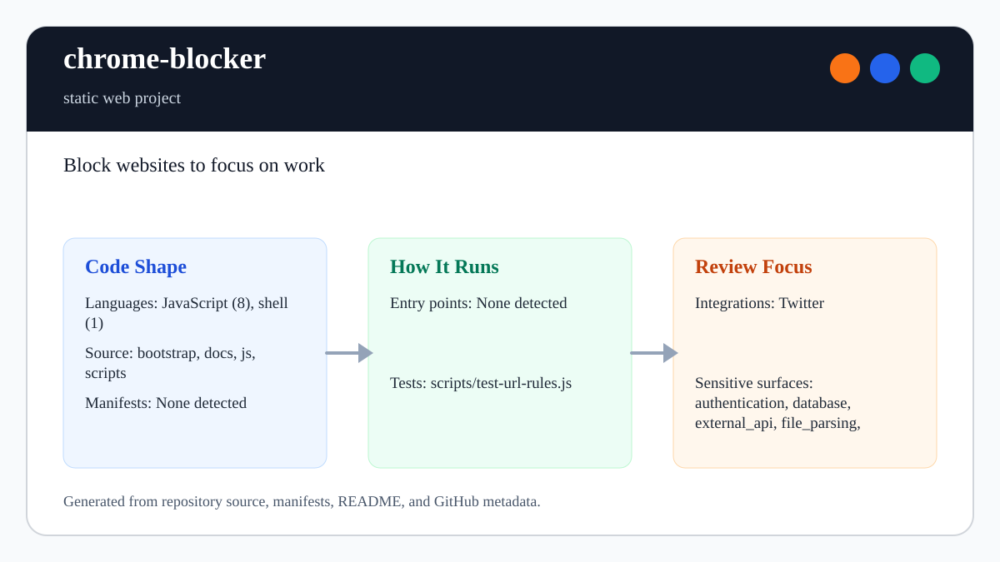

# chrome-blocker

<!-- README-OVERVIEW-IMAGE -->


## Overview

`garethpaul/chrome-blocker` is a static web project. Block websites to focus on work

This README is based on the checked-in source, manifests, scripts, and repository metadata on the `master` branch. The project language mix found during review was: JavaScript (8), shell (1).

## Repository Contents

- `README.md` - project overview and local usage notes
- `bootstrap` - source or example code
- `docs` - source or example code
- `js` - source or example code
- `scripts` - source or example code
- `SECURITY.md` - security reporting and disclosure guidance
- `VISION.md` - project direction and maintenance guardrails

Additional scan context:

- Source directories: bootstrap, docs, js, scripts
- Dependency and build manifests: none detected
- Entry points or build surfaces: none detected
- Test-looking files: scripts/test-url-rules.js

## Getting Started

### Prerequisites

- Git

### Setup

```bash
git clone https://github.com/garethpaul/chrome-blocker.git
cd chrome-blocker
```

The setup commands above are derived from repository files. Legacy mobile, Python, or JavaScript samples may require older SDKs or package versions than a modern workstation uses by default.

## Running or Using the Project

Load the extension unpacked from this directory:

1. Open `chrome://extensions`.
2. Enable developer mode.
3. Choose "Load unpacked" and select this repository root.

## Testing and Verification

Run the SDK-free source baseline and URL-rule tests:

```sh
make check
scripts/check-baseline.sh
node scripts/test-url-rules.js
```

The URL-rule baseline verifies normalized HTTP(S) origin matching, rejected
lookalike hosts, rejected credential-bearing blocker URLs, block-list
deduplication, encoded redirect parameters for `blockedSite.html`, and scoped
manifest host permissions.

When the required SDK or runtime is unavailable, use static checks and source review first, then verify on a machine that has the matching platform toolchain.

## Configuration and Secrets

- Detected references to Twitter. Keep API keys, OAuth credentials, tokens, and account-specific values in local configuration only.

## Security and Privacy Notes

- Review changes touching authentication or token handling; examples from the scan include bootstrap/css/bootstrap.min.css.
- Review changes touching external API calls or credential-adjacent configuration; examples from the scan include bootstrap/css/bootstrap.min.css, bootstrap/js/bootstrap.min.js.
- Review changes touching network requests, sockets, or service endpoints; examples from the scan include bootstrap/css/bootstrap.min.css, bootstrap/js/bootstrap.min.js, scripts/test-url-rules.js.
- Review changes touching file, media, JSON, XML, CSV, OCR, or data parsing; examples from the scan include bootstrap/css/bootstrap.min.css, docs/plans/2026-06-08-chrome-blocker-url-baseline.md, js/jquery-1.8.2.min.js, scripts/check-baseline.sh.
- Review changes touching shell execution, subprocess, or dynamic evaluation; examples from the scan include js/jquery-1.8.2.min.js, js/urlRules.js.
- Review changes touching database, model, or persistence code; examples from the scan include docs/plans/2026-06-08-chrome-blocker-url-baseline.md.

## Maintenance Notes

- The blocked-page unblock countdown clears any prior interval before starting
  a new timer and resets interval state when the modal closes.
- Background tab blocking state is removed when tabs close and ignores invalid
  non-tab navigation ids.
- The content-script redirect messages are normalized before constructing
  `blockedSite.html` URLs.
- The background page owns block-list storage writes; the popup delegates new
  blocked origins instead of writing the same list twice.
- The background add and unblock paths use centralized tab state writes so
  invalid tab ids cannot create stray per-tab entries.
- The blocked page validates the current tab before unlisting a site or showing
  the unblock countdown.
- The blocked page redirects back only after the guarded unlist path runs.
- The popup validates the active tab id before messaging content scripts or
  reading background tab state.
- Host permissions are scoped to HTTP(S) pages to match the URL matcher and
  content-script coverage.
- URL normalization rejects credential-bearing blocker URLs before storing,
  matching, or decoding redirected block origins.
- See `SECURITY.md` for vulnerability reporting and safe research guidance.
- See `VISION.md` for project direction and contribution guardrails.
- See `CHANGES.md` for the maintenance history.
- See `docs/plans/2026-06-08-chrome-blocker-check-wrapper.md` for the root
  verification wrapper baseline.
- See `docs/plans/2026-06-09-chrome-blocker-content-redirect-validation.md`
  for the content-script redirect validation baseline.
- See `docs/plans/2026-06-09-chrome-blocker-background-tab-state-writes.md`
  for the background tab-state write baseline.
- See `docs/plans/2026-06-09-chrome-blocker-blocked-page-tab-guard.md` for the
  blocked-page current-tab guard.
- See `docs/plans/2026-06-09-chrome-blocker-blocked-page-redirect-guard.md` for
  the blocked-page redirect guard.
- See `docs/plans/2026-06-09-chrome-blocker-popup-tab-guard.md` for the popup
  current-tab guard.
- See `docs/plans/2026-06-09-chrome-blocker-http-host-permissions.md` for the
  scoped host-permission baseline.
- See `docs/plans/2026-06-09-chrome-blocker-credential-url-guard.md` for the
  credential-bearing blocker URL guard.

## Contributing

Keep changes small and tied to the project that is already present in this repository. For code changes, document the toolchain used, avoid committing generated dependency directories or local configuration, and update this README when setup or verification steps change.
